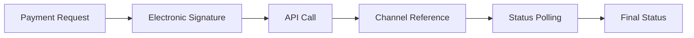

# Rabobank BAI API vs BNP Paribas API4C - Verschillen Analyse

## 📋 Executive Summary

Dit document beschrijft de belangrijkste verschillen tussen de Rabobank Bank Account Information (BAI) API en BNP Paribas API for Corporate (API4C) services, gebaseerd op de implementatie gids v1.0.

---

## 🔐 Authenticatie & Beveiliging

### Rabobank BAI
| Component | Details |
|-----------|---------|
| **SSL Certificaat** | PFX formaat, Rabobank specifieke CA |
| **Signature** | RSA-SHA512 met custom headers |
| **Token Endpoint** | OAuth2 custom implementatie |
| **Validation** | `/testcert` endpoint voor certificaat validatie |
| **Token Validity** | Niet gespecificeerd |

### BNP Paribas API4C
| Component | Details |
|-----------|---------|
| **SSL Certificaat** | Breed scala CA's (DigiCert, GlobalSign, Entrust, etc.) |
| **Signature** | Electronic Signature (eIDAS/RGS/Swift 3Skey) |
| **Token Endpoint** | Gateway authentication systeem |
| **Validation** | `/utilities/testcert` endpoint |
| **Token Validity** | **15 minuten** |

### 🚨 Kritieke Verschillen
- **BNP Electronic Signature**: Vereist eIDAS/RGS compliant certificaten voor payments
- **Self-signed optie**: BNP accepteert zelf-ondertekende certificaten voor qualification environment
- **SFS Secure Sharing**: BNP gebruikt veilige file sharing voor gevoelige data uitwisseling

---

## 🌐 API Structuur & Endpoints

### Rabobank BAI
```
Base URL: https://api.rabobank.nl/openapi/payments/insight
Services:
├── /balances
└── /transactions
```

### BNP Paribas API4C
```
Base URL: https://api.staging.cashmanagement.bnpparibas
Services:
├── /payments (SCT, SCT Instant, International)
├── /reporting (Account statements)
├── /reachability (Beneficiary validation)
└── /utilities (TestCert, etc.)
```

### 🔄 Service Vergelijking
| Feature | Rabobank | BNP Paribas | Impact |
|---------|----------|-------------|--------|
| **Balances** | ✅ Dedicated endpoint | ⚠️ Via reporting | Implementatie aanpassing |
| **Transactions** | ✅ Dedicated endpoint | ✅ Via reporting | Vergelijkbaar |
| **Payments** | ❌ Niet beschikbaar | ✅ Full payment services | **Nieuwe functionaliteit** |
| **Reachability** | ❌ Niet beschikbaar | ✅ Beneficiary check | **Nieuwe functionaliteit** |

---

## 🏗️ Implementatie Architectuur

### Rabobank Huidige Structuur
```
BAI_Tool/
├── Archive/Bank API/
│   ├── RabobankApiClient.cs
│   ├── CAMT053Generator.cs
│   └── MT940Generator.cs
├── Rabobank/UiPath/
│   ├── BAI_API/
│   ├── Database/
│   └── Scripts/
└── Database Schema: bai_rabobank_*
```

### BNP Voorgestelde Structuur
```
BAI_Tool/
├── BNP/
│   ├── Documentation/
│   ├── Certificates/
│   ├── UiPath/
│   │   ├── API4C/
│   │   ├── Database/
│   │   └── Scripts/
│   └── Testing/
└── Database Schema: bai_bnp_*
```

---

## 📊 Data & Response Formats

### Rabobank
- **Format**: JSON responses
- **Standards**: Custom Rabobank format
- **Output**: CAMT.053, MT940 generatie

### BNP Paribas
- **Format**: JSON responses (Swift compliant)
- **Standards**: ISO 20022, Swift messaging
- **Output**: Swift specification compliant reporting

### 🔄 Data Mapping Implicaties
```csharp
// Rabobank response format
{
  "transactions": [...],
  "balances": [...]
}

// BNP response format (reporting API)
{
  "accountStatement": {
    "transactions": [...],
    "balances": [...]
  }
}
```

---

## 🧪 Test Environments

### Rabobank
| Environment | URL | Purpose |
|-------------|-----|---------|
| **Sandbox** | `api.sandbox.rabobank.nl` | Development testing |
| **Production** | `api.rabobank.nl` | Live environment |

### BNP Paribas
| Environment | URL | Purpose |
|-------------|-----|---------|
| **Qualification** | `api.staging.cashmanagement.bnpparibas` | Integration testing |
| **Production** | `api.cashmanagement.bnpparibas` | Live environment |

### 📋 Testing Requirements BNP
- **Mandatory E2E tests** voor production onboarding
- **Penny tests** in production environment
- **Mock mode** voor SCT Instant testing
- **Reachability testing** voor payment validation

---

## 💳 Payment Services (Alleen BNP)

### Payment Types
- **SCT (SEPA Credit Transfer)**
- **SCT Instant** - Real-time payments
- **International Payments**

### Payment Process


### Status Flow
- **PDNG**: Pending (intermediary status)
- **ACCP**: Accepted (final status)
- **RJCT**: Rejected (final status)

---

## 🔧 Herbruikbare Componenten

### Van Rabobank BAI naar BNP API4C

#### ✅ Direct Herbruikbaar
- **Database schema basis** (bai_rabobank_* → bai_bnp_*)
- **HTTP client configuratie** pattern
- **Error handling** mechanisme
- **UiPath workflow** structuur
- **Logging & audit trail** systeem

#### 🔄 Aanpassing Vereist
- **Authentication flow** (OAuth2 → Gateway auth)
- **Response parsing** (custom → Swift compliant)
- **Certificate management** (PFX → diverse CA's)
- **API endpoint** structuur

#### 🆕 Nieuwe Implementatie
- **Electronic Signature** systeem
- **Payment initiation** & status tracking
- **Reachability checking**
- **SFS integration** voor secure file sharing

---

## 📈 Migration Roadmap

### Fase 1: Foundation (Week 1-2)
- [ ] BNP project structure aanmaken
- [ ] SSL certificate setup & TestCert validation
- [ ] Gateway authentication implementatie
- [ ] SFS secure sharing toegang

### Fase 2: Core APIs (Week 3-4)
- [ ] Reporting API (vergelijkbaar met Rabobank transactions)
- [ ] Response parsing & data mapping
- [ ] Database schema migratie (bai_bnp_*)
- [ ] Basic error handling

### Fase 3: Payment Services (Week 5-6)
- [ ] Electronic Signature implementatie
- [ ] Payment initiation API
- [ ] Payment status tracking
- [ ] Reachability API

### Fase 4: Integration & Testing (Week 7-8)
- [ ] UiPath workflows aanpassing
- [ ] E2E testing in qualification environment
- [ ] CAMT.053/MT940 generatie voor BNP data
- [ ] Production readiness testing

---

## ⚠️ Kritieke Aandachtspunten

### Security & Compliance
1. **Electronic Signature**: Vereist eIDAS/RGS certificaten voor production payments
2. **SFS Integration**: Verplicht voor gevoelige data uitwisseling
3. **Token Management**: 15-minuten validity requires refresh logic

### Technical Challenges
1. **Payment Services**: Volledig nieuwe functionaliteit vs. Rabobank read-only
2. **Status Polling**: Complex retry logic voor SCT Instant payments
3. **Certificate Diversity**: Ondersteuning multiple CA's vs. Rabobank single CA

### Integration Impact
1. **Database Schema**: Uitbreiding voor payment data storage
2. **UiPath Workflows**: Nieuwe flows voor payment processing
3. **Reporting Format**: Swift compliant vs. Rabobank custom format

---

## 📞 Support & Onboarding

### BNP Paribas Requirements
- **Implementation Team** contact vereist
- **Direct Connectivity Agreement (DCA)** ondertekening
- **Qualification testing** verplicht voor production access
- **Penny testing** in production environment

### Documentation & Resources
- **Technical Specifications** via SFS sharing
- **Mock endpoints** voor testing
- **E2E test scenarios** validation

---

*Document gegenereerd: November 13, 2025*  
*Versie: 1.0*  
*Gebaseerd op: BNP Paribas API4C Implementation Guideline v1.0*